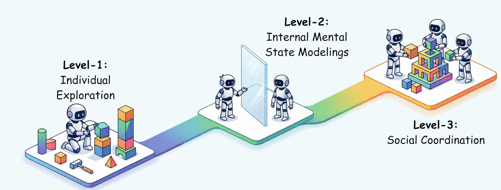

<div align="center">

<!-- Logo / Title -->
<h1>🌍 Awesome Social World Models</h1>

<h3>
  Social World Models: A Comprehensive Survey of Theory of Mind and Social Coordination
</h3>

<p>
  <b>🧠 Theory of Mind</b> ·
  <b>🤖 Embodied AI</b> ·
  <b>🌐 World Models</b> ·
  <b>🤝 Social Coordination</b> ·
  <b>😊 Emotion Modeling</b>
</p>

<!-- Authors -->
<p>
  Ruoxuan Zhang<sup>1</sup>,
  Ziqi Liao<sup>1</sup>,
  Zhiyu Zhou<sup>1</sup>,
  Jian-Yu Jiang-Lin<sup>2</sup>,
  Siyu Wu<sup>1</sup>,
  Yanbo Mao<sup>1</sup>,
  Bin Wen<sup>3</sup>,
  Hongxia Xie<sup>1</sup>,
  Jianlong Fu<sup>4</sup>,
  Meibao Yao<sup>1</sup>,
  Shao-Yuan Lo<sup>2</sup>,
  Wen-Huang Cheng<sup>2</sup>
</p>

<p>
  <sup>1</sup>Jilin University &nbsp; · &nbsp;
  <sup>2</sup>National Taiwan University &nbsp; · &nbsp;
  <sup>3</sup>Nanjing University &nbsp; · &nbsp;
  <sup>4</sup>Microsoft Research Asia
</p>

<!-- Badges -->
<p>
  <a href="https://www.researchgate.net/publication/409127297_Social_World_Models_A_Comprehensive_Survey_of_Theory_of_Mind_and_Social_Coordination?showFulltext=1&linkId=6a5442ee5ec658102990c682">
    
  </a>
  <a href="https://github.com/avclabjlu/Awesome-Social-World-Models/stargazers">
    
  </a>
  <a href="https://github.com/avclabjlu/Awesome-Social-World-Models/network/members">
    
  </a>
  <a href="https://github.com/avclabjlu/Awesome-Social-World-Models">
    
  </a>
</p>

<!-- Short Slogan -->
<p>
  <b>🔥 A curated survey and paper list for social world models, covering mental-state reasoning, emotion understanding, human-robot coordination, and embodied social intelligence.</b>
</p>

<br>

<!-- Banner -->
<p>
  
</p>

<br>

<!-- Quick Navigation -->
<p>
  <a href="#overview">📖 Overview</a> ·
  <a href="#individual-exploration">🧭 Individual Exploration</a> ·
  <a href="#internal-mental-state-modelings">🧠 Mental States</a> ·
  <a href="#theory-of-mind-tom">💡 Theory of Mind</a> ·
  <a href="#emotions">😊 Emotions</a> ·
  <a href="#social-coordination-collective-intelligence-and-norms">🤝 Social Coordination</a> ·
  <a href="#simulators">🖥️ Simulators</a> ·
  <a href="#citation">📚 Citation</a>
</p>

<br>

⭐ If you find this repository useful, please consider giving it a star!

</div>

## Overview

- [Overview](#overview)
- [Individual Exploration](#individual-exploration)
  - [Active Perception and Curiosity-Driven Exploration](#active-perception-and-curiosity-driven-exploration)
    - [From Pixels to Affordances](#from-pixels-to-affordances)
    - [Tool-Use and Skill Discovery](#tool-use-and-skill-discovery)
  - [From Reactive Interaction to Internal World Models](#from-reactive-interaction-to-internal-world-models)
- [Internal Mental State Modelings](#internal-mental-state-modelings)
  - [Theory of Mind (ToM)](#theory-of-mind-tom)
    - [Theory of Mind: Definition and Core Mental State Components](#theory-of-mind-definition-and-core-mental-state-components)
    - [Origins of Theory of Mind: Primate Cognition and Developmental Psychology](#origins-of-theory-of-mind-primate-cognition-and-developmental-psychology)
    - [Taxonomy of Theory of Mind Benchmark and Dataset](#taxonomy-of-theory-of-mind-benchmark-and-dataset)
    - [Taxonomizing Theory-of-Mind Approaches in Large Language Models](#taxonomizing-theory-of-mind-approaches-in-large-language-models)
  - [Emotions](#emotions)
    - [Emotion Understanding](#emotion-understanding)
    - [Affective Generation](#affective-generation)
    - [Emotionally and Cognitively Intelligent Digital Humans: Emotion in World Models](#emotionally-and-cognitively-intelligent-digital-humans-emotion-in-world-models)
    - [From Pattern Matching to Cognitive Resonance](#from-pattern-matching-to-cognitive-resonance)
- [Social Coordination: Collective Intelligence and Norms](#social-coordination-collective-intelligence-and-norms)
  - [Task-Driven Coordination](#task-driven-coordination)
  - [Human-Robot Coordination](#human-robot-coordination)
- [Simulators](#simulators)
- [Citation](#citation)


## Individual Exploration


### Active Perception and Curiosity-Driven Exploration


#### From Pixels to Affordances

- <a id="ref-132-from-pixels-to-affordances"></a>[An Exploration of Embodied Visual Exploration](https://doi.org/10.1007/s11263-021-01437-z). **`2020`**. [[🔗 DOI](https://doi.org/10.1007/s11263-021-01437-z)]
- <a id="ref-186-from-pixels-to-affordances"></a>[Gibson Env: real-world perception for embodied agents](http://gibsonenv.stanford.edu/). **`CVPR 2018`**. [[🌐 Website](http://gibsonenv.stanford.edu/)] [[💻 Code](https://github.com/StanfordVL/GibsonEnv)]
- <a id="ref-63-from-pixels-to-affordances"></a>[ManipVQA: Injecting Robotic Affordance and Physically Grounded Information into Multi-Modal Large Language Models](https://scholar.google.com/scholar?q=ManipVQA%3A+Injecting+Robotic+Affordance+and+Physically+Grounded+Information+into+Multi-Modal+Large+Language+Models). **`2024`**. [[🔗 Link](https://scholar.google.com/scholar?q=ManipVQA%3A+Injecting+Robotic+Affordance+and+Physically+Grounded+Information+into+Multi-Modal+Large+Language+Models)]
- <a id="ref-87-from-pixels-to-affordances"></a>[Vision-Language Foundation Models as Effective Robot Imitators.ICLR (2024)](https://scholar.google.com/scholar?q=Vision-Language+Foundation+Models+as+Effective+Robot+Imitators.ICLR+%282024%29.). **`ICLR 2024`**. [[🔗 Link](https://scholar.google.com/scholar?q=Vision-Language+Foundation+Models+as+Effective+Robot+Imitators.ICLR+%282024%29.)]
- <a id="ref-89-from-pixels-to-affordances"></a>[ManipLLM: Embodied Multimodal Large Language Model for Object-Centric Robotic Manipulation](https://doi.org/10.1109/CVPR52733.2024.01710). **`CVPR 2024`**. [[🔗 DOI](https://doi.org/10.1109/CVPR52733.2024.01710)]
- <a id="ref-131-from-pixels-to-affordances"></a>[AffordanceLLM: Grounding Affordance from Vision Language Models.CVPRW(2024)](https://scholar.google.com/scholar?q=AffordanceLLM%3A+Grounding+Affordance+from+Vision+Language+Models.CVPRW%282024%29.). **`CVPR 2024`**. [[🔗 Link](https://scholar.google.com/scholar?q=AffordanceLLM%3A+Grounding+Affordance+from+Vision+Language+Models.CVPRW%282024%29.)]
- <a id="ref-62-from-pixels-to-affordances"></a>[RoboGround: Robotic Manipulation with Grounded Vision-Language Priors.CVPR(2025)](https://doi.org/10.1109/cvpr52734.2025.02099). **`CVPR 2025`**. [[🔗 DOI](https://doi.org/10.1109/cvpr52734.2025.02099)]
- <a id="ref-227-from-pixels-to-affordances"></a>[Rt-2: Vision-language-action models transfer web knowledge to robotic control](https://scholar.google.com/scholar?q=Rt-2%3A+Vision-language-action+models+transfer+web+knowledge+to+robotic+control). **`CoRL 2023`**. [[🔗 Link](https://scholar.google.com/scholar?q=Rt-2%3A+Vision-language-action+models+transfer+web+knowledge+to+robotic+control)]
- <a id="ref-29-from-pixels-to-affordances"></a>[Palm-e: An embodied multimodal language model.ICML(2023)](https://arxiv.org/abs/2303.03378). **`ICML 2023`**. [[📄 Paper](https://arxiv.org/abs/2303.03378)] [[🌐 Website](https://palm-e.github.io/)]

#### Tool-Use and Skill Discovery

- <a id="ref-23-tool-use-and-skill-discovery"></a>[Autotelic Agents with Intrinsically Motivated Goal-Conditioned Reinforcement Learning: A Short Survey.J](https://doi.org/10.1613/jair.1.13554). **`2022`**. [[🔗 DOI](https://doi.org/10.1613/jair.1.13554)]
- <a id="ref-112-tool-use-and-skill-discovery"></a>[Curiosity-Driven Exploration via Latent Bayesian Surprise.AAAI(2022)](https://doi.org/10.1609/aaai.v36i7.20743). **`AAAI 2022`**. [[🔗 DOI](https://doi.org/10.1609/aaai.v36i7.20743)]
- <a id="ref-98-tool-use-and-skill-discovery"></a>[Odyssey: Empowering Minecraft Agents with Open-World Skills](https://scholar.google.com/scholar?q=Odyssey%3A+Empowering+Minecraft+Agents+with+Open-World+Skills). **`2025`**. [[🔗 Link](https://scholar.google.com/scholar?q=Odyssey%3A+Empowering+Minecraft+Agents+with+Open-World+Skills)]
- <a id="ref-168-tool-use-and-skill-discovery"></a>[Voyager: An open-ended embodied agent with large language models.TMLR(2023)](https://arxiv.org/abs/2305.16291). **`TMLR 2023`**. [[📄 Paper](https://arxiv.org/abs/2305.16291)] [[🌐 Website](https://voyager.minedojo.org/)] [[💻 Code](https://github.com/MineDojo/Voyager)]
- <a id="ref-204-tool-use-and-skill-discovery"></a>[Plan4MC: Skill Reinforcement Learning and Planning for Open-World Minecraft Tasks](https://arxiv.org/abs/2303.16563). **`2023`**. [[📄 Paper](https://arxiv.org/abs/2303.16563)]
- <a id="ref-78-tool-use-and-skill-discovery"></a>[Exploration in deep reinforcement learning: A survey.Inf](https://scholar.google.com/scholar?q=Exploration+in+deep+reinforcement+learning%3A+A+survey.Inf). **`2022`**. [[🔗 Link](https://scholar.google.com/scholar?q=Exploration+in+deep+reinforcement+learning%3A+A+survey.Inf)]
- <a id="ref-198-tool-use-and-skill-discovery"></a>[Exploration in Deep Reinforcement Learning: From Single-Agent to Multiagent Domain.TNNLS(2021)](https://doi.org/10.1109/tnnls.2023.3236361). **`2021`**. [[🔗 DOI](https://doi.org/10.1109/tnnls.2023.3236361)]

### From Reactive Interaction to Internal World Models

- <a id="ref-39-from-reactive-interaction-to-internal-world-models"></a>[AI Agents for Autonomous Driving: An Overview.IEEE Consumer Electronics Magazine(2025)](https://scholar.google.com/scholar?q=AI+Agents+for+Autonomous+Driving%3A+An+Overview.IEEE+Consumer+Electronics+Magazine%282025%29.). **`2025`**. [[🔗 Link](https://scholar.google.com/scholar?q=AI+Agents+for+Autonomous+Driving%3A+An+Overview.IEEE+Consumer+Electronics+Magazine%282025%29.)]
- <a id="ref-40-from-reactive-interaction-to-internal-world-models"></a>[Embodied ai agents: Modeling the world](https://arxiv.org/abs/2506.22355). **`2025`**. [[📄 Paper](https://arxiv.org/abs/2506.22355)]
- <a id="ref-86-from-reactive-interaction-to-internal-world-models"></a>[A comprehensive survey on world models for embodied ai](https://arxiv.org/abs/2510.16732). **`2025`**. [[📄 Paper](https://arxiv.org/abs/2510.16732)]
- <a id="ref-100-from-reactive-interaction-to-internal-world-models"></a>[Aligning Cyber Space With Physical World: A Comprehensive Survey on Embodied AI.IEEE/ASME Transactions on Mechatronics (2025)](https://doi.org/10.1109/TMECH.2025.3574943). **`2025`**. [[🔗 DOI](https://doi.org/10.1109/TMECH.2025.3574943)]
- <a id="ref-105-from-reactive-interaction-to-internal-world-models"></a>[A survey: Learning embodied intelligence from physical simulators and world models](https://arxiv.org/abs/2507.00917). **`2025`**. [[📄 Paper](https://arxiv.org/abs/2507.00917)]
- <a id="ref-16-from-reactive-interaction-to-internal-world-models"></a>[Pali-x: On scaling up a multilingual vision and language model](https://arxiv.org/abs/2305.18565). **`CVPR 2024`**. [[📄 Paper](https://arxiv.org/abs/2305.18565)]
- <a id="ref-30-from-reactive-interaction-to-internal-world-models"></a>[Palm-e: An embodied multimodal language model](https://arxiv.org/abs/2303.03378). **`2023`**. [[📄 Paper](https://arxiv.org/abs/2303.03378)] [[🌐 Website](https://palm-e.github.io/)]
- <a id="ref-227-from-reactive-interaction-to-internal-world-models"></a>[Rt-2: Vision-language-action models transfer web knowledge to robotic control](https://scholar.google.com/scholar?q=Rt-2%3A+Vision-language-action+models+transfer+web+knowledge+to+robotic+control). **`CoRL 2023`**. [[🔗 Link](https://scholar.google.com/scholar?q=Rt-2%3A+Vision-language-action+models+transfer+web+knowledge+to+robotic+control)]
- <a id="ref-75-from-reactive-interaction-to-internal-world-models"></a>[Openvla: An open-source vision-language-action model](https://arxiv.org/abs/2406.09246). **`2025`**. [[📄 Paper](https://arxiv.org/abs/2406.09246)] [[🌐 Website](https://openvla.github.io/)] [[💻 Code](https://github.com/openvla/openvla)]
- <a id="ref-10-from-reactive-interaction-to-internal-world-models"></a>[𝜋0: A Vision-Language-Action Flow Model for General Robot Control](https://arxiv.org/abs/2410.24164). **`2024`**. [[📄 Paper](https://arxiv.org/abs/2410.24164)] [[🌐 Website](https://www.physicalintelligence.company/blog/pi0)]
- <a id="ref-124-from-reactive-interaction-to-internal-world-models"></a>[Fast: Efficient action tokenization for vision-language-action models.arXiv preprint arXiv:2501.09747 (2025)](https://arxiv.org/abs/2501.09747). **`2025`**. [[📄 Paper](https://arxiv.org/abs/2501.09747)]
- <a id="ref-67-from-reactive-interaction-to-internal-world-models"></a>[𝜋0.5: a Vision-Language-Action Model with Open-World Generalization](https://arxiv.org/abs/2504.16054). **`2025`**. [[📄 Paper](https://arxiv.org/abs/2504.16054)]
- <a id="ref-66-from-reactive-interaction-to-internal-world-models"></a>[𝜋0.7: a Steerable Generalist Robotic Foundation Model with Emergent Capabilities](https://scholar.google.com/scholar?q=%F0%9D%9C%8B0.7%3A+a+Steerable+Generalist+Robotic+Foundation+Model+with+Emergent+Capabilities). **`2026`**. [[🔗 Link](https://scholar.google.com/scholar?q=%F0%9D%9C%8B0.7%3A+a+Steerable+Generalist+Robotic+Foundation+Model+with+Emergent+Capabilities)]
- <a id="ref-111-from-reactive-interaction-to-internal-world-models"></a>[Deep learning, reinforcement learning, and world models.Neural Networks(2022)](https://scholar.google.com/scholar?q=Deep+learning%2C+reinforcement+learning%2C+and+world+models.Neural+Networks%282022%29.). **`2022`**. [[🔗 Link](https://scholar.google.com/scholar?q=Deep+learning%2C+reinforcement+learning%2C+and+world+models.Neural+Networks%282022%29.)]
- <a id="ref-64-from-reactive-interaction-to-internal-world-models"></a>[Inner monologue: Embodied reasoning through planning with language models](https://arxiv.org/abs/2207.05608). **`2022`**. [[📄 Paper](https://arxiv.org/abs/2207.05608)]
- <a id="ref-152-from-reactive-interaction-to-internal-world-models"></a>[Reflexion: Language agents with verbal reinforcement learning.NeurIPS(2023)](https://arxiv.org/abs/2303.11366). **`NeurIPS 2023`**. [[📄 Paper](https://arxiv.org/abs/2303.11366)]
- <a id="ref-168-from-reactive-interaction-to-internal-world-models"></a>[Voyager: An open-ended embodied agent with large language models.TMLR(2023)](https://arxiv.org/abs/2305.16291). **`TMLR 2023`**. [[📄 Paper](https://arxiv.org/abs/2305.16291)] [[🌐 Website](https://voyager.minedojo.org/)] [[💻 Code](https://github.com/MineDojo/Voyager)]
- <a id="ref-200-from-reactive-interaction-to-internal-world-models"></a>[React: Synergizing reasoning and acting in language models](https://arxiv.org/abs/2210.03629). **`ICLR 2022`**. [[📄 Paper](https://arxiv.org/abs/2210.03629)] [[🌐 Website](https://react-lm.github.io/)] [[💻 Code](https://github.com/ysymyth/ReAct)]
- <a id="ref-49-from-reactive-interaction-to-internal-world-models"></a>[Recurrent World Models Facilitate Policy Evolution](https://arxiv.org/abs/1809.01999). **`NeurIPS 2018`**. [[📄 Paper](https://arxiv.org/abs/1809.01999)] [[🌐 Website](https://worldmodels.github.io/)] [[💻 Code](https://github.com/hardmaru/WorldModelsExperiments)]
- <a id="ref-50-from-reactive-interaction-to-internal-world-models"></a>[Dream to control: Learning behaviors by latent imagination](https://arxiv.org/abs/1912.01603). **`2019`**. [[📄 Paper](https://arxiv.org/abs/1912.01603)]
- <a id="ref-51-from-reactive-interaction-to-internal-world-models"></a>[Learning Latent Dynamics for Planning from Pixels](https://scholar.google.com/scholar?q=Learning+Latent+Dynamics+for+Planning+from+Pixels.). **`2019`**. [[🔗 Link](https://scholar.google.com/scholar?q=Learning+Latent+Dynamics+for+Planning+from+Pixels.)]
- <a id="ref-52-from-reactive-interaction-to-internal-world-models"></a>[Mastering Atari with Discrete World Models.ICLR(2021)](https://arxiv.org/abs/2010.02193). **`ICLR 2021`**. [[📄 Paper](https://arxiv.org/abs/2010.02193)]
- <a id="ref-53-from-reactive-interaction-to-internal-world-models"></a>[Mastering diverse control tasks through world models.Nature(2025)](https://scholar.google.com/scholar?q=Mastering+diverse+control+tasks+through+world+models.Nature%282025%29.). **`Nature 2025`**. [[🔗 Link](https://scholar.google.com/scholar?q=Mastering+diverse+control+tasks+through+world+models.Nature%282025%29.)]
- <a id="ref-54-from-reactive-interaction-to-internal-world-models"></a>[Mastering Diverse Domains through World Models.ArXiv(2023)](https://arxiv.org/abs/2301.04104). **`2023`**. [[📄 Paper](https://arxiv.org/abs/2301.04104)] [[💻 Code](https://github.com/danijar/dreamerv3)]
- <a id="ref-57-from-reactive-interaction-to-internal-world-models"></a>[Temporal Difference Learning for Model Predictive Control](https://scholar.google.com/scholar?q=Temporal+Difference+Learning+for+Model+Predictive+Control). **`ICML 2022`**. [[🔗 Link](https://scholar.google.com/scholar?q=Temporal+Difference+Learning+for+Model+Predictive+Control)]
- <a id="ref-56-from-reactive-interaction-to-internal-world-models"></a>[TD-MPC2: Scalable, Robust World Models for Continuous Control](https://arxiv.org/abs/2310.16828). **`ICLR 2024`**. [[📄 Paper](https://arxiv.org/abs/2310.16828)] [[💻 Code](https://github.com/nicklashansen/tdmpc2)]
- <a id="ref-142-from-reactive-interaction-to-internal-world-models"></a>[Mastering Atari, Go, chess and shogi by planning with a learned model.Nature(2019)](https://arxiv.org/abs/1911.08265). **`Nature 2019`**. [[📄 Paper](https://arxiv.org/abs/1911.08265)]
- <a id="ref-113-from-reactive-interaction-to-internal-world-models"></a>[Transformers are Sample-Efficient World Models](https://scholar.google.com/scholar?q=Transformers+are+Sample-Efficient+World+Models). **`ICLR 2023`**. [[🔗 Link](https://scholar.google.com/scholar?q=Transformers+are+Sample-Efficient+World+Models)]
- <a id="ref-27-from-reactive-interaction-to-internal-world-models"></a>[Understanding world or predicting future? a comprehensive survey of world models](https://scholar.google.com/scholar?q=Understanding+world+or+predicting+future%3F+a+comprehensive+survey+of+world+models). **`2025`**. [[🔗 Link](https://scholar.google.com/scholar?q=Understanding+world+or+predicting+future%3F+a+comprehensive+survey+of+world+models)]
- <a id="ref-191-from-reactive-interaction-to-internal-world-models"></a>[From 2d to 3d cognition: A brief survey of general world models](https://arxiv.org/abs/2506.20134). **`2025`**. [[📄 Paper](https://arxiv.org/abs/2506.20134)]
- <a id="ref-170-from-reactive-interaction-to-internal-world-models"></a>[VAGEN: Reinforcing World Model Reasoning for Multi-Turn VLM Agents](https://scholar.google.com/scholar?q=VAGEN%3A+Reinforcing+World+Model+Reasoning+for+Multi-Turn+VLM+Agents). **`NeurIPS 2025`**. [[🔗 Link](https://scholar.google.com/scholar?q=VAGEN%3A+Reinforcing+World+Model+Reasoning+for+Multi-Turn+VLM+Agents)]
- <a id="ref-125-from-reactive-interaction-to-internal-world-models"></a>[PoE-World: Compositional World Modeling with Products of Programmatic Experts](https://scholar.google.com/scholar?q=PoE-World%3A+Compositional+World+Modeling+with+Products+of+Programmatic+Experts). **`NeurIPS 2025`**. [[🔗 Link](https://scholar.google.com/scholar?q=PoE-World%3A+Compositional+World+Modeling+with+Products+of+Programmatic+Experts)]
- <a id="ref-216-from-reactive-interaction-to-internal-world-models"></a>[Neuro-Symbolic Synergy for Interactive World Modeling](https://arxiv.org/abs/2602.10480). **`2026`**. [[📄 Paper](https://arxiv.org/abs/2602.10480)]
- <a id="ref-210-from-reactive-interaction-to-internal-world-models"></a>[Theory of Space: Can Foundation Models Construct Spatial Beliefs through Active Exploration?](https://scholar.google.com/scholar?q=Theory+of+Space%3A+Can+Foundation+Models+Construct+Spatial+Beliefs+through+Active+Exploration%3F). **`2026`**. [[🔗 Link](https://scholar.google.com/scholar?q=Theory+of+Space%3A+Can+Foundation+Models+Construct+Spatial+Beliefs+through+Active+Exploration%3F)]
- <a id="ref-171-from-reactive-interaction-to-internal-world-models"></a>[ENACT: Evaluating Embodied Cognition with World Modeling of Egocentric Interaction](https://arxiv.org/abs/2511.20937). **`2025`**. [[📄 Paper](https://arxiv.org/abs/2511.20937)]

## Internal Mental State Modelings

- <a id="ref-4-internal-mental-state-modelings"></a>[Theoretical explanations of children’s understanding of the mind](https://scholar.google.com/scholar?q=Theoretical+explanations+of+children%E2%80%99s+understanding+of+the+mind). **`1991`**. [[🔗 Link](https://scholar.google.com/scholar?q=Theoretical+explanations+of+children%E2%80%99s+understanding+of+the+mind)]
- <a id="ref-37-internal-mental-state-modelings"></a>[Developmental changes in young children’s knowledge about the mind.Cognitive Development5, 1 (1990), 1–27](https://scholar.google.com/scholar?q=Developmental+changes+in+young+children%E2%80%99s+knowledge+about+the+mind.Cognitive+Development5%2C+1+%281990%29%2C+1%E2%80%9327.). **`1990`**. [[🔗 Link](https://scholar.google.com/scholar?q=Developmental+changes+in+young+children%E2%80%99s+knowledge+about+the+mind.Cognitive+Development5%2C+1+%281990%29%2C+1%E2%80%9327.)]
- <a id="ref-59-internal-mental-state-modelings"></a>[Cambridge University Press](https://scholar.google.com/scholar?q=Cambridge+University+Press.). **`1994.Mapping the mind: Domain specificity in cognition and culture`**. [[🔗 Link](https://scholar.google.com/scholar?q=Cambridge+University+Press.)]

### Theory of Mind (ToM)


#### Theory of Mind: Definition and Core Mental State Components

- <a id="ref-7-theory-of-mind-definition-and-core-mental-state-components"></a>[Systematic review and inventory of theory of mind measures for young children.Frontiers in psychology10 (2020), 2905](https://scholar.google.com/scholar?q=Systematic+review+and+inventory+of+theory+of+mind+measures+for+young+children.Frontiers+in+psychology10+%282020%29%2C+2905.). **`2020`**. [[🔗 Link](https://scholar.google.com/scholar?q=Systematic+review+and+inventory+of+theory+of+mind+measures+for+young+children.Frontiers+in+psychology10+%282020%29%2C+2905.)]
- <a id="ref-180-theory-of-mind-definition-and-core-mental-state-components"></a>[Beliefs about beliefs: Representation and constraining function of wrong beliefs in young children’s understanding of deception.Cognition13 (1983), 103–128](https://www.semanticscholar.org/paper/17014009). **`1983`**. [[🔗 Link](https://www.semanticscholar.org/paper/17014009)]
- <a id="ref-38-theory-of-mind-definition-and-core-mental-state-components"></a>[Young children’s knowledge about visual perception: Hiding objects from others.Child Development49, 4 (1978), 1208–1211](https://doi.org/10.2307/1128761). **`1978`**. [[🔗 DOI](https://doi.org/10.2307/1128761)]
- <a id="ref-121-theory-of-mind-definition-and-core-mental-state-components"></a>[The Ease and Extent of Recursive Mindreading, across Implicit and Explicit Tasks.Cognition137 (2015), 161–175](https://scholar.google.com/scholar?q=The+Ease+and+Extent+of+Recursive+Mindreading%2C+across+Implicit+and+Explicit+Tasks.Cognition137+%282015%29%2C+161%E2%80%93175). **`2015`**. [[🔗 Link](https://scholar.google.com/scholar?q=The+Ease+and+Extent+of+Recursive+Mindreading%2C+across+Implicit+and+Explicit+Tasks.Cognition137+%282015%29%2C+161%E2%80%93175)]
- <a id="ref-126-theory-of-mind-definition-and-core-mental-state-components"></a>[Second-Order False Beliefs and Linguistic Recursion in Autism Spectrum Disorder.Journal of Autism and Developmental Disorders52, 9 (2022), 3991–4006](https://doi.org/10.1007/s10803-021-05277-1). **`2022`**. [[🔗 DOI](https://doi.org/10.1007/s10803-021-05277-1)]
- <a id="ref-97-theory-of-mind-definition-and-core-mental-state-components"></a>[Neural correlates of belief- and desire-reasoning.Child Development80, 4 (2009), 1163–1171](https://doi.org/10.1111/j.1467-8624.2009.01323.x). **`2009`**. [[🔗 DOI](https://doi.org/10.1111/j.1467-8624.2009.01323.x)]
- <a id="ref-167-theory-of-mind-definition-and-core-mental-state-components"></a>[MOMENTS: A Comprehensive Multimodal Benchmark for Theory of Mind](https://arxiv.org/abs/2507.04415). **`2025`**. [[📄 Paper](https://arxiv.org/abs/2507.04415)]
- <a id="ref-133-theory-of-mind-definition-and-core-mental-state-components"></a>[BDI Agents: From Theory to Practice](https://www.semanticscholar.org/paper/5216982). **`1995`**. [[🔗 Link](https://www.semanticscholar.org/paper/5216982)]
- <a id="ref-162-theory-of-mind-definition-and-core-mental-state-components"></a>[Affective computing: A review](https://scholar.google.com/scholar?q=Affective+computing%3A+A+review). **`2005`**. [[🔗 Link](https://scholar.google.com/scholar?q=Affective+computing%3A+A+review)]
- <a id="ref-174-theory-of-mind-definition-and-core-mental-state-components"></a>[A systematic review on affective computing: Emotion models, databases, and recent advances](https://scholar.google.com/scholar?q=A+systematic+review+on+affective+computing%3A+Emotion+models%2C+databases%2C+and+recent+advances). **`2022`**. [[🔗 Link](https://scholar.google.com/scholar?q=A+systematic+review+on+affective+computing%3A+Emotion+models%2C+databases%2C+and+recent+advances)]
- <a id="ref-101-theory-of-mind-definition-and-core-mental-state-components"></a>[TactfulToM: Do LLMs Have the Theory of Mind Ability to Understand White Lies?ArXivabs/2509.17054 (2025)](https://arxiv.org/abs/2509.17054). **`2025`**. [[📄 Paper](https://arxiv.org/abs/2509.17054)]

#### Origins of Theory of Mind: Primate Cognition and Developmental Psychology

- <a id="ref-127-origins-of-theory-of-mind-primate-cognition-and-developmental-psychology"></a>[Does the chimpanzee have a theory of mind?Behavioral and brain sciences 1, 4 (1978), 515–526](https://scholar.google.com/scholar?q=Does+the+chimpanzee+have+a+theory+of+mind%3FBehavioral+and+brain+sciences+1%2C+4+%281978%29%2C+515%E2%80%93526.). **`1978`**. [[🔗 Link](https://scholar.google.com/scholar?q=Does+the+chimpanzee+have+a+theory+of+mind%3FBehavioral+and+brain+sciences+1%2C+4+%281978%29%2C+515%E2%80%93526.)]
- <a id="ref-180-origins-of-theory-of-mind-primate-cognition-and-developmental-psychology"></a>[Beliefs about beliefs: Representation and constraining function of wrong beliefs in young children’s understanding of deception.Cognition13 (1983), 103–128](https://www.semanticscholar.org/paper/17014009). **`1983`**. [[🔗 Link](https://www.semanticscholar.org/paper/17014009)]
- <a id="ref-175-origins-of-theory-of-mind-primate-cognition-and-developmental-psychology"></a>[Meta-analysis of theory-of-mind development: the truth about false belief.Child development72 3 (2001), 655–84](https://www.semanticscholar.org/paper/11269306). **`2001`**. [[🔗 Link](https://www.semanticscholar.org/paper/11269306)]
- <a id="ref-37-origins-of-theory-of-mind-primate-cognition-and-developmental-psychology"></a>[Developmental changes in young children’s knowledge about the mind.Cognitive Development5, 1 (1990), 1–27](https://scholar.google.com/scholar?q=Developmental+changes+in+young+children%E2%80%99s+knowledge+about+the+mind.Cognitive+Development5%2C+1+%281990%29%2C+1%E2%80%9327.). **`1990`**. [[🔗 Link](https://scholar.google.com/scholar?q=Developmental+changes+in+young+children%E2%80%99s+knowledge+about+the+mind.Cognitive+Development5%2C+1+%281990%29%2C+1%E2%80%9327.)]
- <a id="ref-4-origins-of-theory-of-mind-primate-cognition-and-developmental-psychology"></a>[Theoretical explanations of children’s understanding of the mind](https://scholar.google.com/scholar?q=Theoretical+explanations+of+children%E2%80%99s+understanding+of+the+mind). **`1991`**. [[🔗 Link](https://scholar.google.com/scholar?q=Theoretical+explanations+of+children%E2%80%99s+understanding+of+the+mind)]
- <a id="ref-133-origins-of-theory-of-mind-primate-cognition-and-developmental-psychology"></a>[BDI Agents: From Theory to Practice](https://www.semanticscholar.org/paper/5216982). **`1995`**. [[🔗 Link](https://www.semanticscholar.org/paper/5216982)]

#### Taxonomy of Theory of Mind Benchmark and Dataset

- <a id="ref-205-taxonomy-of-theory-of-mind-benchmark-and-dataset"></a>[Towards conversation entailment: An empirical investigation](https://scholar.google.com/scholar?q=Towards+conversation+entailment%3A+An+empirical+investigation). **`2010`**. [[🔗 Link](https://scholar.google.com/scholar?q=Towards+conversation+entailment%3A+An+empirical+investigation)]
- <a id="ref-58-taxonomy-of-theory-of-mind-benchmark-and-dataset"></a>[Exploring RoBERTa’s theory of mind through textual entailment](https://www.semanticscholar.org/paper/235357901). **`2021`**. [[🔗 Link](https://www.semanticscholar.org/paper/235357901)]
- <a id="ref-79-taxonomy-of-theory-of-mind-benchmark-and-dataset"></a>[Revisiting the Evaluation of Theory of Mind through Question Answering](https://doi.org/10.18653/v1/D19-1598). **`EMNLP 2019`**. [[🔗 DOI](https://doi.org/10.18653/v1/D19-1598)]
- <a id="ref-184-taxonomy-of-theory-of-mind-benchmark-and-dataset"></a>[Hi-tom: A benchmark for evaluating higher-order theory of mind reasoning in large language models](https://scholar.google.com/scholar?q=Hi-tom%3A+A+benchmark+for+evaluating+higher-order+theory+of+mind+reasoning+in+large+language+models). **`EMNLP 2023`**. [[🔗 Link](https://scholar.google.com/scholar?q=Hi-tom%3A+A+benchmark+for+evaluating+higher-order+theory+of+mind+reasoning+in+large+language+models)]
- <a id="ref-18-taxonomy-of-theory-of-mind-benchmark-and-dataset"></a>[ToMBench: Benchmarking Theory of Mind in Large Language Models](https://arxiv.org/abs/2402.15052). **`2024`**. [[📄 Paper](https://arxiv.org/abs/2402.15052)] [[💻 Code](https://github.com/zhchen18/ToMBench)]
- <a id="ref-103-taxonomy-of-theory-of-mind-benchmark-and-dataset"></a>[InterIntent: Investigating Social Intelligence of LLMs via Intention Understanding in an Interactive Game Context](https://www.semanticscholar.org/paper/270562157). **`2024`**. [[🔗 Link](https://www.semanticscholar.org/paper/270562157)]
- <a id="ref-149-taxonomy-of-theory-of-mind-benchmark-and-dataset"></a>[How well do large language models perform on faux pas tests?](https://scholar.google.com/scholar?q=How+well+do+large+language+models+perform+on+faux+pas+tests%3F). **`ACL 2023`**. [[🔗 Link](https://scholar.google.com/scholar?q=How+well+do+large+language+models+perform+on+faux+pas+tests%3F)]
- <a id="ref-224-taxonomy-of-theory-of-mind-benchmark-and-dataset"></a>[I cast detect thoughts: Learning to converse and guide with intents and theory-of-mind in dungeons and dragons](https://scholar.google.com/scholar?q=I+cast+detect+thoughts%3A+Learning+to+converse+and+guide+with+intents+and+theory-of-mind+in+dungeons+and+dragons). **`2023`**. [[🔗 Link](https://scholar.google.com/scholar?q=I+cast+detect+thoughts%3A+Learning+to+converse+and+guide+with+intents+and+theory-of-mind+in+dungeons+and+dragons)]
- <a id="ref-145-taxonomy-of-theory-of-mind-benchmark-and-dataset"></a>[Symmetric machine theory of mind](https://scholar.google.com/scholar?q=Symmetric+machine+theory+of+mind). **`2022`**. [[🔗 Link](https://scholar.google.com/scholar?q=Symmetric+machine+theory+of+mind)]
- <a id="ref-118-taxonomy-of-theory-of-mind-benchmark-and-dataset"></a>[PHASE: PHysically- grounded Abstract Social Events for Machine Social Perception](https://arxiv.org/abs/2103.01933). **`2021`**. [[📄 Paper](https://arxiv.org/abs/2103.01933)]
- <a id="ref-6-taxonomy-of-theory-of-mind-benchmark-and-dataset"></a>[MindCraft: Theory of mind modeling for situated dialogue in collaborative tasks](https://scholar.google.com/scholar?q=MindCraft%3A+Theory+of+mind+modeling+for+situated+dialogue+in+collaborative+tasks). **`2021`**. [[🔗 Link](https://scholar.google.com/scholar?q=MindCraft%3A+Theory+of+mind+modeling+for+situated+dialogue+in+collaborative+tasks)]
- <a id="ref-34-taxonomy-of-theory-of-mind-benchmark-and-dataset"></a>[SoMi-ToM: Evaluating Multi-Perspective Theory of Mind in Embodied Social Interactions](https://arxiv.org/abs/2506.23046). **`2025`**. [[📄 Paper](https://arxiv.org/abs/2506.23046)]
- <a id="ref-167-taxonomy-of-theory-of-mind-benchmark-and-dataset"></a>[MOMENTS: A Comprehensive Multimodal Benchmark for Theory of Mind](https://arxiv.org/abs/2507.04415). **`2025`**. [[📄 Paper](https://arxiv.org/abs/2507.04415)]
- <a id="ref-69-taxonomy-of-theory-of-mind-benchmark-and-dataset"></a>[MMToM-QA: Multimodal Theory of Mind Question Answering](https://arxiv.org/abs/2401.08743). **`2024`**. [[📄 Paper](https://arxiv.org/abs/2401.08743)]
- <a id="ref-151-taxonomy-of-theory-of-mind-benchmark-and-dataset"></a>[Muma-tom: Multi-modal multi-agent theory of mind](https://scholar.google.com/scholar?q=Muma-tom%3A+Multi-modal+multi-agent+theory+of+mind). **`AAAI 2025`**. [[🔗 Link](https://scholar.google.com/scholar?q=Muma-tom%3A+Multi-modal+multi-agent+theory+of+mind)]
- <a id="ref-117-taxonomy-of-theory-of-mind-benchmark-and-dataset"></a>[Evaluating theory of mind in question answering](https://scholar.google.com/scholar?q=Evaluating+theory+of+mind+in+question+answering). **`2018`**. [[🔗 Link](https://scholar.google.com/scholar?q=Evaluating+theory+of+mind+in+question+answering)]
- <a id="ref-138-taxonomy-of-theory-of-mind-benchmark-and-dataset"></a>[Socialiqa: Commonsense reasoning about social interactions](https://arxiv.org/abs/1904.09728). **`2019`**. [[📄 Paper](https://arxiv.org/abs/1904.09728)]
- <a id="ref-166-taxonomy-of-theory-of-mind-benchmark-and-dataset"></a>[Best: The belief and sentiment corpus](https://scholar.google.com/scholar?q=Best%3A+The+belief+and+sentiment+corpus). **`2022`**. [[🔗 Link](https://scholar.google.com/scholar?q=Best%3A+The+belief+and+sentiment+corpus)]
- <a id="ref-157-taxonomy-of-theory-of-mind-benchmark-and-dataset"></a>[LLMs achieve adult human performance on higher- order theory of mind tasks.Frontiers in Human Neuroscience19 (2024)](https://api.semanticscholar.org/CorpusID:). **`2024`**. [[🔗 Link](https://api.semanticscholar.org/CorpusID:)]
- <a id="ref-148-taxonomy-of-theory-of-mind-benchmark-and-dataset"></a>[Clever hans or neural theory of mind? stress testing social reasoning in large language models](https://scholar.google.com/scholar?q=Clever+hans+or+neural+theory+of+mind%3F+stress+testing+social+reasoning+in+large+language+models). **`2024`**. [[🔗 Link](https://scholar.google.com/scholar?q=Clever+hans+or+neural+theory+of+mind%3F+stress+testing+social+reasoning+in+large+language+models)]
- <a id="ref-107-taxonomy-of-theory-of-mind-benchmark-and-dataset"></a>[ToMChallenges: A Principle-Guided Dataset and Diverse Evaluation Tasks for Exploring Theory of Mind](https://arxiv.org/abs/2305.15068). **`2023`**. [[📄 Paper](https://arxiv.org/abs/2305.15068)]
- <a id="ref-74-taxonomy-of-theory-of-mind-benchmark-and-dataset"></a>[FANToM: A benchmark for stress-testing machine theory of mind in interactions](https://arxiv.org/abs/2310.15421). **`2023`**. [[📄 Paper](https://arxiv.org/abs/2310.15421)] [[💻 Code](https://github.com/skywalker023/fantom)]
- <a id="ref-42-taxonomy-of-theory-of-mind-benchmark-and-dataset"></a>[Understanding Social Reasoning in Language Models with Language Models](https://arxiv.org/abs/2306.15448). **`2023`**. [[📄 Paper](https://arxiv.org/abs/2306.15448)]
- <a id="ref-135-taxonomy-of-theory-of-mind-benchmark-and-dataset"></a>[Do LLMs selectively encode the goal of an agent’s reach?](https://openreview.net/forum?id=KxvXjtyuYl). **`2023`**. [[🌐 Website](https://openreview.net/forum?id=KxvXjtyuYl)]
- <a id="ref-223-taxonomy-of-theory-of-mind-benchmark-and-dataset"></a>[How FaR Are Large Language Models From Agents with Theory-of-Mind?ArXivabs/2310.03051 (2023)](https://arxiv.org/abs/2310.03051). **`2023`**. [[📄 Paper](https://arxiv.org/abs/2310.03051)]
- <a id="ref-114-taxonomy-of-theory-of-mind-benchmark-and-dataset"></a>[Can LLMs Keep a Secret? Testing Privacy Implications of Language Models via Contextual Integrity Theory.ArXiv abs/2310.17884 (2023)](https://arxiv.org/abs/2310.17884). **`2023`**. [[📄 Paper](https://arxiv.org/abs/2310.17884)]
- <a id="ref-77-taxonomy-of-theory-of-mind-benchmark-and-dataset"></a>[Theory of mind may have spontaneously emerged in large language models.arXiv preprint arXiv:2302.020834 (2023), 169](https://arxiv.org/abs/2302.02083). **`2023`**. [[📄 Paper](https://arxiv.org/abs/2302.02083)]
- <a id="ref-181-taxonomy-of-theory-of-mind-benchmark-and-dataset"></a>[Coke: A cognitive knowledge graph for machine theory of mind](https://scholar.google.com/scholar?q=Coke%3A+A+cognitive+knowledge+graph+for+machine+theory+of+mind). **`2024`**. [[🔗 Link](https://scholar.google.com/scholar?q=Coke%3A+A+cognitive+knowledge+graph+for+machine+theory+of+mind)]
- <a id="ref-193-taxonomy-of-theory-of-mind-benchmark-and-dataset"></a>[OpenToM: A Comprehensive Benchmark for Evaluating Theory-of-Mind Reasoning Capabilities of Large Language Models](https://arxiv.org/abs/2402.06044). **`2024`**. [[📄 Paper](https://arxiv.org/abs/2402.06044)]
- <a id="ref-12-taxonomy-of-theory-of-mind-benchmark-and-dataset"></a>[NegotiationToM: A Benchmark for Stress-testing Machine Theory of Mind on Negotiation Surrounding](https://arxiv.org/abs/2404.13627). **`2024`**. [[📄 Paper](https://arxiv.org/abs/2404.13627)]
- <a id="ref-2-taxonomy-of-theory-of-mind-benchmark-and-dataset"></a>[Do LLMs Exhibit Human-Like Reasoning? Evaluating Theory of Mind in LLMs for Open-Ended Responses.ArXiv abs/2406.05659 (2024)](https://arxiv.org/abs/2406.05659). **`2024`**. [[📄 Paper](https://arxiv.org/abs/2406.05659)]
- <a id="ref-120-taxonomy-of-theory-of-mind-benchmark-and-dataset"></a>[Probing the Robustness of Theory of Mind in Large Language Models](https://arxiv.org/abs/2410.06271). **`2024`**. [[📄 Paper](https://arxiv.org/abs/2410.06271)]
- <a id="ref-136-taxonomy-of-theory-of-mind-benchmark-and-dataset"></a>[EmoBench: Evaluating the Emotional Intelligence of Large Language Models](https://arxiv.org/abs/2402.12071). **`2024`**. [[📄 Paper](https://arxiv.org/abs/2402.12071)]
- <a id="ref-156-taxonomy-of-theory-of-mind-benchmark-and-dataset"></a>[Views Are My Own, but Also Yours: Benchmarking Theory of Mind Us- ing Common Ground](https://doi.org/10.18653/v1/2024.findings-acl.880). **`ACL 2024`**. [[🔗 DOI](https://doi.org/10.18653/v1/2024.findings-acl.880)]
- <a id="ref-144-taxonomy-of-theory-of-mind-benchmark-and-dataset"></a>[Melanie Sclar, Jane Dwivedi-Yu, Maryam Fazel-Zarandi, Yulia Tsvetkov, Yonatan Bisk, Yejin Choi, and Asli Celikyilmaz](https://scholar.google.com/scholar?q=Melanie+Sclar%2C+Jane+Dwivedi-Yu%2C+Maryam+Fazel-Zarandi%2C+Yulia+Tsvetkov%2C+Yonatan+Bisk%2C+Yejin+Choi%2C+and+Asli+Celikyilmaz). [[🔗 Link](https://scholar.google.com/scholar?q=Melanie+Sclar%2C+Jane+Dwivedi-Yu%2C+Maryam+Fazel-Zarandi%2C+Yulia+Tsvetkov%2C+Yonatan+Bisk%2C+Yejin+Choi%2C+and+Asli+Celikyilmaz)]
- <a id="ref-60-taxonomy-of-theory-of-mind-benchmark-and-dataset"></a>[EgoSocialArena: Benchmarking the Social Intelligence of Large Language Models from a First-person Perspective](https://arxiv.org/abs/2410.06195). **`2024`**. [[📄 Paper](https://arxiv.org/abs/2410.06195)]
- <a id="ref-9-taxonomy-of-theory-of-mind-benchmark-and-dataset"></a>[How Well Can LLMs Negotiate? NegotiationArena Platform and Analysis](https://arxiv.org/abs/2402.05863). **`2024`**. [[📄 Paper](https://arxiv.org/abs/2402.05863)]
- <a id="ref-71-taxonomy-of-theory-of-mind-benchmark-and-dataset"></a>[Perceptions to Beliefs: Exploring Precursory Inferences for Theory of Mind in Large Language Models.ArXiv abs/2407.06004 (2024)](https://arxiv.org/abs/2407.06004). **`2024`**. [[📄 Paper](https://arxiv.org/abs/2407.06004)]
- <a id="ref-202-taxonomy-of-theory-of-mind-benchmark-and-dataset"></a>[PersuasiveToM: A Benchmark for Evaluating Machine Theory of Mind in Persuasive Dialogues](https://arxiv.org/abs/2502.21017). **`2025`**. [[📄 Paper](https://arxiv.org/abs/2502.21017)]
- <a id="ref-163-taxonomy-of-theory-of-mind-benchmark-and-dataset"></a>[UniToMBench: Integrating Perspective-Taking to Improve Theory of Mind in LLMs](https://arxiv.org/abs/2506.09450). **`2025`**. [[📄 Paper](https://arxiv.org/abs/2506.09450)]
- <a id="ref-84-taxonomy-of-theory-of-mind-benchmark-and-dataset"></a>[RecToM: A Benchmark for Evaluating Machine Theory of Mind in LLM-based Conversational Recommender Systems](https://arxiv.org/abs/2511.22275). **`2025`**. [[📄 Paper](https://arxiv.org/abs/2511.22275)]
- <a id="ref-13-taxonomy-of-theory-of-mind-benchmark-and-dataset"></a>[Xtom: Exploring the multilingual theory of mind for large language models](https://arxiv.org/abs/2506.02461). **`2025`**. [[📄 Paper](https://arxiv.org/abs/2506.02461)]
- <a id="ref-189-taxonomy-of-theory-of-mind-benchmark-and-dataset"></a>[Towards dynamic theory of mind: Evaluating llm adaptation to temporal evolution of human states](https://scholar.google.com/scholar?q=Towards+dynamic+theory+of+mind%3A+Evaluating+llm+adaptation+to+temporal+evolution+of+human+states). **`2025`**. [[🔗 Link](https://scholar.google.com/scholar?q=Towards+dynamic+theory+of+mind%3A+Evaluating+llm+adaptation+to+temporal+evolution+of+human+states)]
- <a id="ref-33-taxonomy-of-theory-of-mind-benchmark-and-dataset"></a>[Who is mistaken?arXiv preprint arXiv:1612.01175 (2016)](https://arxiv.org/abs/1612.01175). **`2016`**. [[📄 Paper](https://arxiv.org/abs/1612.01175)]
- <a id="ref-46-taxonomy-of-theory-of-mind-benchmark-and-dataset"></a>[Commonsense interpretation of triangle behavior](https://scholar.google.com/scholar?q=Commonsense+interpretation+of+triangle+behavior). **`AAAI 2016`**. [[🔗 Link](https://scholar.google.com/scholar?q=Commonsense+interpretation+of+triangle+behavior)]
- <a id="ref-129-taxonomy-of-theory-of-mind-benchmark-and-dataset"></a>[Watch-And-Help: A Challenge for Social Perception and Human-AI Collaboration](https://arxiv.org/abs/2010.09890). **`2021`**. [[📄 Paper](https://arxiv.org/abs/2010.09890)]
- <a id="ref-43-taxonomy-of-theory-of-mind-benchmark-and-dataset"></a>[Baby Intuitions Benchmark (BIB): Discerning the goals, preferences, and actions of others.Advances in neural information processing systems34 (2021), 9963–9976](https://scholar.google.com/scholar?q=Baby+Intuitions+Benchmark+%28BIB%29%3A+Discerning+the+goals%2C+preferences%2C+and+actions+of+others.Advances+in+neural+information+processing+systems34+%282021%29%2C+9963%E2%80%939976.). **`2021`**. [[🔗 Link](https://scholar.google.com/scholar?q=Baby+Intuitions+Benchmark+%28BIB%29%3A+Discerning+the+goals%2C+preferences%2C+and+actions+of+others.Advances+in+neural+information+processing+systems34+%282021%29%2C+9963%E2%80%939976.)]
- <a id="ref-154-taxonomy-of-theory-of-mind-benchmark-and-dataset"></a>[Agent: A benchmark for core psychological reasoning](https://scholar.google.com/scholar?q=Agent%3A+A+benchmark+for+core+psychological+reasoning). **`2021`**. [[🔗 Link](https://scholar.google.com/scholar?q=Agent%3A+A+benchmark+for+core+psychological+reasoning)]
- <a id="ref-68-taxonomy-of-theory-of-mind-benchmark-and-dataset"></a>[Beyond emotion: A multi-modal dataset for human desire understanding](https://scholar.google.com/scholar?q=Beyond+emotion%3A+A+multi-modal+dataset+for+human+desire+understanding). **`2022`**. [[🔗 Link](https://scholar.google.com/scholar?q=Beyond+emotion%3A+A+multi-modal+dataset+for+human+desire+understanding)]
- <a id="ref-155-taxonomy-of-theory-of-mind-benchmark-and-dataset"></a>[Mindgames: Targeting theory of mind in large language models with dynamic epistemic modal logic](https://arxiv.org/abs/2305.03353). **`2023`**. [[📄 Paper](https://arxiv.org/abs/2305.03353)] [[💻 Code](https://github.com/antoinelrnld/modlog)]
- <a id="ref-1-taxonomy-of-theory-of-mind-benchmark-and-dataset"></a>[Modeling communication of collaborative multiagent system under epistemic planning.International Journal of Intelligent Systems36 (2019), 5959 – 5980](https://www.semanticscholar.org/paper/235794746). **`2019`**. [[🔗 Link](https://www.semanticscholar.org/paper/235794746)]
- <a id="ref-83-taxonomy-of-theory-of-mind-benchmark-and-dataset"></a>[Theory of Mind for Multi-Agent Collaboration via Large Language Models](https://doi.org/10.18653/v1/2023.emnlp-main.13). **`EMNLP 2023`**. [[🔗 DOI](https://doi.org/10.18653/v1/2023.emnlp-main.13)]
- <a id="ref-222-taxonomy-of-theory-of-mind-benchmark-and-dataset"></a>[Large Language Models as Commonsense Knowledge for Large-Scale Task Planning](https://arxiv.org/abs/2305.14078). **`2023`**. [[📄 Paper](https://arxiv.org/abs/2305.14078)]
- <a id="ref-130-taxonomy-of-theory-of-mind-benchmark-and-dataset"></a>[NOPA: Neurally-guided Online Probabilistic Assistance for Building Socially Intelligent Home Assistants](https://arxiv.org/abs/2301.05223). **`2023`**. [[📄 Paper](https://arxiv.org/abs/2301.05223)]
- <a id="ref-85-taxonomy-of-theory-of-mind-benchmark-and-dataset"></a>[An infant-cognition inspired machine benchmark for identifying agency, affiliation, belief, and intention](https://scholar.google.com/scholar?q=An+infant-cognition+inspired+machine+benchmark+for+identifying+agency%2C+affiliation%2C+belief%2C+and+intention). **`2024`**. [[🔗 Link](https://scholar.google.com/scholar?q=An+infant-cognition+inspired+machine+benchmark+for+identifying+agency%2C+affiliation%2C+belief%2C+and+intention)]
- <a id="ref-32-taxonomy-of-theory-of-mind-benchmark-and-dataset"></a>[Constrained Human-AI Cooperation: An Inclusive Embodied Social Intelligence Challenge](https://arxiv.org/abs/2411.01796). **`2024`**. [[📄 Paper](https://arxiv.org/abs/2411.01796)]
- <a id="ref-8-taxonomy-of-theory-of-mind-benchmark-and-dataset"></a>[CHARTOM: A Visual Theory-of-Mind Benchmark for LLMs on Misleading Charts](https://arxiv.org/abs/2408.14419). **`2024`**. [[📄 Paper](https://arxiv.org/abs/2408.14419)]
- <a id="ref-110-taxonomy-of-theory-of-mind-benchmark-and-dataset"></a>[BDIQA: A new dataset for video question answering to explore cognitive reasoning through theory of mind](https://scholar.google.com/scholar?q=BDIQA%3A+A+new+dataset+for+video+question+answering+to+explore+cognitive+reasoning+through+theory+of+mind). **`AAAI 2024`**. [[🔗 Link](https://scholar.google.com/scholar?q=BDIQA%3A+A+new+dataset+for+video+question+answering+to+explore+cognitive+reasoning+through+theory+of+mind)]
- <a id="ref-88-taxonomy-of-theory-of-mind-benchmark-and-dataset"></a>[Xinyang Li, Siqi Liu, Bochao Zou, Jiansheng Chen, and Huimin Ma](https://scholar.google.com/scholar?q=Xinyang+Li%2C+Siqi+Liu%2C+Bochao+Zou%2C+Jiansheng+Chen%2C+and+Huimin+Ma). [[🔗 Link](https://scholar.google.com/scholar?q=Xinyang+Li%2C+Siqi+Liu%2C+Bochao+Zou%2C+Jiansheng+Chen%2C+and+Huimin+Ma)]
- <a id="ref-17-taxonomy-of-theory-of-mind-benchmark-and-dataset"></a>[Through the Theory of Mind’s Eye: Reading Minds with Multimodal Video Large Language Models](https://arxiv.org/abs/2406.13763). **`2025`**. [[📄 Paper](https://arxiv.org/abs/2406.13763)]
- <a id="ref-211-taxonomy-of-theory-of-mind-benchmark-and-dataset"></a>[MindPower: Enabling Theory-of-Mind Reasoning in VLM-based Embodied Agents](https://scholar.google.com/scholar?q=MindPower%3A+Enabling+Theory-of-Mind+Reasoning+in+VLM-based+Embodied+Agents). **`2026`**. [[🔗 Link](https://scholar.google.com/scholar?q=MindPower%3A+Enabling+Theory-of-Mind+Reasoning+in+VLM-based+Embodied+Agents)]
- <a id="ref-133-taxonomy-of-theory-of-mind-benchmark-and-dataset"></a>[BDI Agents: From Theory to Practice](https://www.semanticscholar.org/paper/5216982). **`1995`**. [[🔗 Link](https://www.semanticscholar.org/paper/5216982)]

#### Taxonomizing Theory-of-Mind Approaches in Large Language Models

- <a id="ref-77-taxonomizing-theory-of-mind-approaches-in-large-language-models"></a>[Theory of mind may have spontaneously emerged in large language models.arXiv preprint arXiv:2302.020834 (2023), 169](https://arxiv.org/abs/2302.02083). **`2023`**. [[📄 Paper](https://arxiv.org/abs/2302.02083)]
- <a id="ref-127-taxonomizing-theory-of-mind-approaches-in-large-language-models"></a>[Does the chimpanzee have a theory of mind?Behavioral and brain sciences 1, 4 (1978), 515–526](https://scholar.google.com/scholar?q=Does+the+chimpanzee+have+a+theory+of+mind%3FBehavioral+and+brain+sciences+1%2C+4+%281978%29%2C+515%E2%80%93526.). **`1978`**. [[🔗 Link](https://scholar.google.com/scholar?q=Does+the+chimpanzee+have+a+theory+of+mind%3FBehavioral+and+brain+sciences+1%2C+4+%281978%29%2C+515%E2%80%93526.)]
- <a id="ref-137-taxonomizing-theory-of-mind-approaches-in-large-language-models"></a>[Neural theory-of-mind? on the limits of social intelligence in large lms](https://scholar.google.com/scholar?q=Neural+theory-of-mind%3F+on+the+limits+of+social+intelligence+in+large+lms). **`2022`**. [[🔗 Link](https://scholar.google.com/scholar?q=Neural+theory-of-mind%3F+on+the+limits+of+social+intelligence+in+large+lms)]
- <a id="ref-110-taxonomizing-theory-of-mind-approaches-in-large-language-models"></a>[BDIQA: A new dataset for video question answering to explore cognitive reasoning through theory of mind](https://scholar.google.com/scholar?q=BDIQA%3A+A+new+dataset+for+video+question+answering+to+explore+cognitive+reasoning+through+theory+of+mind). **`AAAI 2024`**. [[🔗 Link](https://scholar.google.com/scholar?q=BDIQA%3A+A+new+dataset+for+video+question+answering+to+explore+cognitive+reasoning+through+theory+of+mind)]
- <a id="ref-60-taxonomizing-theory-of-mind-approaches-in-large-language-models"></a>[EgoSocialArena: Benchmarking the Social Intelligence of Large Language Models from a First-person Perspective](https://arxiv.org/abs/2410.06195). **`2024`**. [[📄 Paper](https://arxiv.org/abs/2410.06195)]
- <a id="ref-153-taxonomizing-theory-of-mind-approaches-in-large-language-models"></a>[Tomato: Verbalizing the mental states of role-playing llms for benchmarking theory of mind](https://scholar.google.com/scholar?q=Tomato%3A+Verbalizing+the+mental+states+of+role-playing+llms+for+benchmarking+theory+of+mind). **`AAAI 2025`**. [[🔗 Link](https://scholar.google.com/scholar?q=Tomato%3A+Verbalizing+the+mental+states+of+role-playing+llms+for+benchmarking+theory+of+mind)]
- <a id="ref-167-taxonomizing-theory-of-mind-approaches-in-large-language-models"></a>[MOMENTS: A Comprehensive Multimodal Benchmark for Theory of Mind](https://arxiv.org/abs/2507.04415). **`2025`**. [[📄 Paper](https://arxiv.org/abs/2507.04415)]
- <a id="ref-151-taxonomizing-theory-of-mind-approaches-in-large-language-models"></a>[Muma-tom: Multi-modal multi-agent theory of mind](https://scholar.google.com/scholar?q=Muma-tom%3A+Multi-modal+multi-agent+theory+of+mind). **`AAAI 2025`**. [[🔗 Link](https://scholar.google.com/scholar?q=Muma-tom%3A+Multi-modal+multi-agent+theory+of+mind)]
- <a id="ref-184-taxonomizing-theory-of-mind-approaches-in-large-language-models"></a>[Hi-tom: A benchmark for evaluating higher-order theory of mind reasoning in large language models](https://scholar.google.com/scholar?q=Hi-tom%3A+A+benchmark+for+evaluating+higher-order+theory+of+mind+reasoning+in+large+language+models). **`EMNLP 2023`**. [[🔗 Link](https://scholar.google.com/scholar?q=Hi-tom%3A+A+benchmark+for+evaluating+higher-order+theory+of+mind+reasoning+in+large+language+models)]
- <a id="ref-179-taxonomizing-theory-of-mind-approaches-in-large-language-models"></a>[Think twice: Perspective-taking improves large language models’ theory-of-mind capabilities](https://scholar.google.com/scholar?q=Think+twice%3A+Perspective-taking+improves+large+language+models%E2%80%99+theory-of-mind+capabilities). **`2024`**. [[🔗 Link](https://scholar.google.com/scholar?q=Think+twice%3A+Perspective-taking+improves+large+language+models%E2%80%99+theory-of-mind+capabilities)]
- <a id="ref-74-taxonomizing-theory-of-mind-approaches-in-large-language-models"></a>[FANToM: A benchmark for stress-testing machine theory of mind in interactions](https://arxiv.org/abs/2310.15421). **`2023`**. [[📄 Paper](https://arxiv.org/abs/2310.15421)] [[💻 Code](https://github.com/skywalker023/fantom)]
- <a id="ref-202-taxonomizing-theory-of-mind-approaches-in-large-language-models"></a>[PersuasiveToM: A Benchmark for Evaluating Machine Theory of Mind in Persuasive Dialogues](https://arxiv.org/abs/2502.21017). **`2025`**. [[📄 Paper](https://arxiv.org/abs/2502.21017)]
- <a id="ref-6-taxonomizing-theory-of-mind-approaches-in-large-language-models"></a>[MindCraft: Theory of mind modeling for situated dialogue in collaborative tasks](https://scholar.google.com/scholar?q=MindCraft%3A+Theory+of+mind+modeling+for+situated+dialogue+in+collaborative+tasks). **`2021`**. [[🔗 Link](https://scholar.google.com/scholar?q=MindCraft%3A+Theory+of+mind+modeling+for+situated+dialogue+in+collaborative+tasks)]
- <a id="ref-119-taxonomizing-theory-of-mind-approaches-in-large-language-models"></a>[Memory-augmented theory of mind network](https://scholar.google.com/scholar?q=Memory-augmented+theory+of+mind+network). **`AAAI 2023`**. [[🔗 Link](https://scholar.google.com/scholar?q=Memory-augmented+theory+of+mind+network)]
- <a id="ref-144-taxonomizing-theory-of-mind-approaches-in-large-language-models"></a>[Melanie Sclar, Jane Dwivedi-Yu, Maryam Fazel-Zarandi, Yulia Tsvetkov, Yonatan Bisk, Yejin Choi, and Asli Celikyilmaz](https://scholar.google.com/scholar?q=Melanie+Sclar%2C+Jane+Dwivedi-Yu%2C+Maryam+Fazel-Zarandi%2C+Yulia+Tsvetkov%2C+Yonatan+Bisk%2C+Yejin+Choi%2C+and+Asli+Celikyilmaz). [[🔗 Link](https://scholar.google.com/scholar?q=Melanie+Sclar%2C+Jane+Dwivedi-Yu%2C+Maryam+Fazel-Zarandi%2C+Yulia+Tsvetkov%2C+Yonatan+Bisk%2C+Yejin+Choi%2C+and+Asli+Celikyilmaz)]
- <a id="ref-192-taxonomizing-theory-of-mind-approaches-in-large-language-models"></a>[EnigmaToM: Improve LLMs’ Theory-of-Mind Reasoning Capabilities with Neural Knowledge Base of Entity States](https://arxiv.org/abs/2503.03340). **`2025`**. [[📄 Paper](https://arxiv.org/abs/2503.03340)]
- <a id="ref-61-taxonomizing-theory-of-mind-approaches-in-large-language-models"></a>[TimeToM: Temporal Space is the Key to Unlocking the Door of Large Language Models’ Theory-of-Mind](https://scholar.google.com/scholar?q=TimeToM%3A+Temporal+Space+is+the+Key+to+Unlocking+the+Door+of+Large+Language+Models%E2%80%99+Theory-of-Mind). **`ACL 2024`**. [[🔗 Link](https://scholar.google.com/scholar?q=TimeToM%3A+Temporal+Space+is+the+Key+to+Unlocking+the+Door+of+Large+Language+Models%E2%80%99+Theory-of-Mind)]
- <a id="ref-95-taxonomizing-theory-of-mind-approaches-in-large-language-models"></a>[Andy Liu, Hao Zhu, Emmy Liu, Yonatan Bisk, and Graham Neubig](https://scholar.google.com/scholar?q=Andy+Liu%2C+Hao+Zhu%2C+Emmy+Liu%2C+Yonatan+Bisk%2C+and+Graham+Neubig). [[🔗 Link](https://scholar.google.com/scholar?q=Andy+Liu%2C+Hao+Zhu%2C+Emmy+Liu%2C+Yonatan+Bisk%2C+and+Graham+Neubig)]
- <a id="ref-226-taxonomizing-theory-of-mind-approaches-in-large-language-models"></a>[Few-shot language coordination by modeling theory of mind](https://scholar.google.com/scholar?q=Few-shot+language+coordination+by+modeling+theory+of+mind). **`2021`**. [[🔗 Link](https://scholar.google.com/scholar?q=Few-shot+language+coordination+by+modeling+theory+of+mind)]
- <a id="ref-178-taxonomizing-theory-of-mind-approaches-in-large-language-models"></a>[Collective intelligence in human-AI teams: A Bayesian theory of mind approach](https://scholar.google.com/scholar?q=Collective+intelligence+in+human-AI+teams%3A+A+Bayesian+theory+of+mind+approach). **`AAAI 2023`**. [[🔗 Link](https://scholar.google.com/scholar?q=Collective+intelligence+in+human-AI+teams%3A+A+Bayesian+theory+of+mind+approach)]
- <a id="ref-206-taxonomizing-theory-of-mind-approaches-in-large-language-models"></a>[Chunhui Zhang, Zhongyu Ouyang, Kwonjoon Lee, Nakul Agarwal, Sean Dae Houlihan, Soroush Vosoughi, and Shao-Yuan Lo](https://scholar.google.com/scholar?q=Chunhui+Zhang%2C+Zhongyu+Ouyang%2C+Kwonjoon+Lee%2C+Nakul+Agarwal%2C+Sean+Dae+Houlihan%2C+Soroush+Vosoughi%2C+and+Shao-Yuan+Lo). [[🔗 Link](https://scholar.google.com/scholar?q=Chunhui+Zhang%2C+Zhongyu+Ouyang%2C+Kwonjoon+Lee%2C+Nakul+Agarwal%2C+Sean+Dae+Houlihan%2C+Soroush+Vosoughi%2C+and+Shao-Yuan+Lo)]
- <a id="ref-222-taxonomizing-theory-of-mind-approaches-in-large-language-models"></a>[Large Language Models as Commonsense Knowledge for Large-Scale Task Planning](https://arxiv.org/abs/2305.14078). **`2023`**. [[📄 Paper](https://arxiv.org/abs/2305.14078)]
- <a id="ref-25-taxonomizing-theory-of-mind-approaches-in-large-language-models"></a>[Logan Cross, Violet Xiang, Agam Bhatia, Daniel LK Yamins, and Nick Haber](https://scholar.google.com/scholar?q=Logan+Cross%2C+Violet+Xiang%2C+Agam+Bhatia%2C+Daniel+LK+Yamins%2C+and+Nick+Haber). [[🔗 Link](https://scholar.google.com/scholar?q=Logan+Cross%2C+Violet+Xiang%2C+Agam+Bhatia%2C+Daniel+LK+Yamins%2C+and+Nick+Haber)]
- <a id="ref-5-taxonomizing-theory-of-mind-approaches-in-large-language-models"></a>[Towards collaborative plan acquisition through theory of mind modeling in situated dialogue](https://scholar.google.com/scholar?q=Towards+collaborative+plan+acquisition+through+theory+of+mind+modeling+in+situated+dialogue). **`2023`**. [[🔗 Link](https://scholar.google.com/scholar?q=Towards+collaborative+plan+acquisition+through+theory+of+mind+modeling+in+situated+dialogue)]

### Emotions


#### Emotion Understanding

- <a id="ref-19-emotion-understanding"></a>[Emotion-LLaMA: Multimodal Emotion Recognition and Reasoning with Instruction Tuning](https://emotion-lama.github.io/). **`2024`**. [[🌐 Website](https://emotion-lama.github.io/)]
- <a id="ref-197-emotion-understanding"></a>[Omni-emotion: Extending video mllm with detailed face and audio modeling for multimodal emotion analysis](https://arxiv.org/abs/2501.09502). **`2025`**. [[📄 Paper](https://arxiv.org/abs/2501.09502)]
- <a id="ref-35-emotion-understanding"></a>[EMOE: Modality-Specific Enhanced Dynamic Emotion Experts](https://scholar.google.com/scholar?q=EMOE%3A+Modality-Specific+Enhanced+Dynamic+Emotion+Experts). **`2025`**. [[🔗 Link](https://scholar.google.com/scholar?q=EMOE%3A+Modality-Specific+Enhanced+Dynamic+Emotion+Experts)]
- <a id="ref-190-emotion-understanding"></a>[Emovit: Revolutionizing emotion insights with visual instruction tuning](https://scholar.google.com/scholar?q=Emovit%3A+Revolutionizing+emotion+insights+with+visual+instruction+tuning). **`2024`**. [[🔗 Link](https://scholar.google.com/scholar?q=Emovit%3A+Revolutionizing+emotion+insights+with+visual+instruction+tuning)]
- <a id="ref-90-emotion-understanding"></a>[OV-MER: Towards Open-Vocabulary Multimodal Emotion Recognition](https://arxiv.org/abs/2410.01495). **`2024`**. [[📄 Paper](https://arxiv.org/abs/2410.01495)]
- <a id="ref-55-emotion-understanding"></a>[Benchmarking and bridging emotion conflicts for multimodal emotion reasoning](https://scholar.google.com/scholar?q=Benchmarking+and+bridging+emotion+conflicts+for+multimodal+emotion+reasoning). **`2025`**. [[🔗 Link](https://scholar.google.com/scholar?q=Benchmarking+and+bridging+emotion+conflicts+for+multimodal+emotion+reasoning)]
- <a id="ref-214-emotion-understanding"></a>[VidEmo: Affective-Tree Reasoning for Emotion-Centric Video Foundation Models](https://arxiv.org/abs/2511.02712). **`2025`**. [[📄 Paper](https://arxiv.org/abs/2511.02712)]
- <a id="ref-48-emotion-understanding"></a>[Stimuvar: Spatiotemporal stimuli-aware video affective reasoning with multimodal large language models.International Journal of Computer Vision133, 9 (2025), 6456–6472](https://scholar.google.com/scholar?q=Stimuvar%3A+Spatiotemporal+stimuli-aware+video+affective+reasoning+with+multimodal+large+language+models.International+Journal+of+Computer+Vision133%2C+9+%282025%29%2C+6456%E2%80%936472.). **`2025`**. [[🔗 Link](https://scholar.google.com/scholar?q=Stimuvar%3A+Spatiotemporal+stimuli-aware+video+affective+reasoning+with+multimodal+large+language+models.International+Journal+of+Computer+Vision133%2C+9+%282025%29%2C+6456%E2%80%936472.)]
- <a id="ref-36-emotion-understanding"></a>[Video-r1: Reinforcing video reasoning in mllms.arXiv preprint arXiv:2503.21776 (2025)](https://arxiv.org/abs/2503.21776). **`2025`**. [[📄 Paper](https://arxiv.org/abs/2503.21776)]
- <a id="ref-91-emotion-understanding"></a>[AffectGPT- R1: Leveraging Reinforcement Learning for Open-Vocabulary Multimodal Emotion Recognition](https://arxiv.org/abs/2508.01318). **`2025`**. [[📄 Paper](https://arxiv.org/abs/2508.01318)]
- <a id="ref-217-emotion-understanding"></a>[R1-omni: Explainable omni-multimodal emotion recognition with reinforcement learning](https://arxiv.org/abs/2503.05379). **`2025`**. [[📄 Paper](https://arxiv.org/abs/2503.05379)]

#### Affective Generation

- <a id="ref-207-affective-generation"></a>[Emoart: A multidimensional dataset for emotion-aware artistic generation](https://scholar.google.com/scholar?q=Emoart%3A+A+multidimensional+dataset+for+emotion-aware+artistic+generation). **`2025`**. [[🔗 Link](https://scholar.google.com/scholar?q=Emoart%3A+A+multidimensional+dataset+for+emotion-aware+artistic+generation)]
- <a id="ref-143-affective-generation"></a>[EmoNet-Face: An expert-annotated benchmark for synthetic emotion recognition](https://arxiv.org/abs/2505.20033). **`2025`**. [[📄 Paper](https://arxiv.org/abs/2505.20033)]
- <a id="ref-195-affective-generation"></a>[Emogen: Emotional image content generation with text-to-image diffusion models](https://scholar.google.com/scholar?q=Emogen%3A+Emotional+image+content+generation+with+text-to-image+diffusion+models). **`2024`**. [[🔗 Link](https://scholar.google.com/scholar?q=Emogen%3A+Emotional+image+content+generation+with+text-to-image+diffusion+models)]
- <a id="ref-196-affective-generation"></a>[Emoedit: Evoking emotions through image manipulation](https://scholar.google.com/scholar?q=Emoedit%3A+Evoking+emotions+through+image+manipulation). **`2025`**. [[🔗 Link](https://scholar.google.com/scholar?q=Emoedit%3A+Evoking+emotions+through+image+manipulation)]
- <a id="ref-80-affective-generation"></a>[Large language models understand and can be enhanced by emotional stimuli.arXiv preprint arXiv:2307.11760 (2023)](https://arxiv.org/abs/2307.11760). **`2023`**. [[📄 Paper](https://arxiv.org/abs/2307.11760)]
- <a id="ref-164-affective-generation"></a>[Marco-Voice Technical Report](https://arxiv.org/abs/2508.02038). **`2025`**. [[📄 Paper](https://arxiv.org/abs/2508.02038)]
- <a id="ref-102-affective-generation"></a>[Sora: A review on background, technology, limitations, and opportunities of large vision models](https://arxiv.org/abs/2402.17177). **`2024`**. [[📄 Paper](https://arxiv.org/abs/2402.17177)]
- <a id="ref-161-affective-generation"></a>[Flowvqtalker: High-quality emotional talking face generation through normalizing flow and quantization](https://scholar.google.com/scholar?q=Flowvqtalker%3A+High-quality+emotional+talking+face+generation+through+normalizing+flow+and+quantization). **`2024`**. [[🔗 Link](https://scholar.google.com/scholar?q=Flowvqtalker%3A+High-quality+emotional+talking+face+generation+through+normalizing+flow+and+quantization)]

#### Emotionally and Cognitively Intelligent Digital Humans: Emotion in World Models

- <a id="ref-19-emotionally-and-cognitively-intelligent-digital-humans-emotion-in-world-models"></a>[Emotion-LLaMA: Multimodal Emotion Recognition and Reasoning with Instruction Tuning](https://emotion-lama.github.io/). **`2024`**. [[🌐 Website](https://emotion-lama.github.io/)]
- <a id="ref-116-emotionally-and-cognitively-intelligent-digital-humans-emotion-in-world-models"></a>[EAI: Emotional decision-making of LLMs in strategic games and ethical dilemmas.Advances in Neural Information Processing Systems37 (2024), 53969–54002](https://scholar.google.com/scholar?q=EAI%3A+Emotional+decision-making+of+LLMs+in+strategic+games+and+ethical+dilemmas.Advances+in+Neural+Information+Processing+Systems37+%282024%29%2C+53969%E2%80%9354002.). **`2024`**. [[🔗 Link](https://scholar.google.com/scholar?q=EAI%3A+Emotional+decision-making+of+LLMs+in+strategic+games+and+ethical+dilemmas.Advances+in+Neural+Information+Processing+Systems37+%282024%29%2C+53969%E2%80%9354002.)]
- <a id="ref-214-emotionally-and-cognitively-intelligent-digital-humans-emotion-in-world-models"></a>[VidEmo: Affective-Tree Reasoning for Emotion-Centric Video Foundation Models](https://arxiv.org/abs/2511.02712). **`2025`**. [[📄 Paper](https://arxiv.org/abs/2511.02712)]
- <a id="ref-80-emotionally-and-cognitively-intelligent-digital-humans-emotion-in-world-models"></a>[Large language models understand and can be enhanced by emotional stimuli.arXiv preprint arXiv:2307.11760 (2023)](https://arxiv.org/abs/2307.11760). **`2023`**. [[📄 Paper](https://arxiv.org/abs/2307.11760)]
- <a id="ref-225-emotionally-and-cognitively-intelligent-digital-humans-emotion-in-world-models"></a>[Sotopia: Interactive evaluation for social intelligence in language agents](https://arxiv.org/abs/2310.11667). **`2023`**. [[📄 Paper](https://arxiv.org/abs/2310.11667)] [[🌐 Website](https://www.sotopia.world/)] [[💻 Code](https://github.com/sotopia-lab/sotopia)]
- <a id="ref-161-emotionally-and-cognitively-intelligent-digital-humans-emotion-in-world-models"></a>[Flowvqtalker: High-quality emotional talking face generation through normalizing flow and quantization](https://scholar.google.com/scholar?q=Flowvqtalker%3A+High-quality+emotional+talking+face+generation+through+normalizing+flow+and+quantization). **`2024`**. [[🔗 Link](https://scholar.google.com/scholar?q=Flowvqtalker%3A+High-quality+emotional+talking+face+generation+through+normalizing+flow+and+quantization)]

#### From Pattern Matching to Cognitive Resonance

- <a id="ref-219-from-pattern-matching-to-cognitive-resonance"></a>[Don’t lose yourself! empathetic response generation via explicit self-other awareness](https://scholar.google.com/scholar?q=Don%E2%80%99t+lose+yourself%21+empathetic+response+generation+via+explicit+self-other+awareness). **`ACL 2023`**. [[🔗 Link](https://scholar.google.com/scholar?q=Don%E2%80%99t+lose+yourself%21+empathetic+response+generation+via+explicit+self-other+awareness)]
- <a id="ref-220-from-pattern-matching-to-cognitive-resonance"></a>[TransESC: smoothing emotional support conversa- tion via turn-level state transition](https://arxiv.org/abs/2305.03296). **`2023`**. [[📄 Paper](https://arxiv.org/abs/2305.03296)]
- <a id="ref-212-from-pattern-matching-to-cognitive-resonance"></a>[ESCoT: Towards Interpretable Emotional Support Dialogue Systems](https://doi.org/10.18653/v1/2024.acl-long.723). **`ACL 2024`**. [[🔗 DOI](https://doi.org/10.18653/v1/2024.acl-long.723)]

## Social Coordination: Collective Intelligence and Norms


### Task-Driven Coordination

- <a id="ref-92-task-driven-coordination"></a>[Mindforge: Empowering embodied agents with theory of mind for lifelong cultural learning](https://scholar.google.com/scholar?q=Mindforge%3A+Empowering+embodied+agents+with+theory+of+mind+for+lifelong+cultural+learning). **`2025`**. [[🔗 Link](https://scholar.google.com/scholar?q=Mindforge%3A+Empowering+embodied+agents+with+theory+of+mind+for+lifelong+cultural+learning)]
- <a id="ref-209-task-driven-coordination"></a>[Combo: Compositional world models for embodied multi-agent cooperation](https://arxiv.org/abs/2404.10775). **`2024`**. [[📄 Paper](https://arxiv.org/abs/2404.10775)]
- <a id="ref-109-task-driven-coordination"></a>[Roco: Dialectic multi-robot collaboration with large language models](https://scholar.google.com/scholar?q=Roco%3A+Dialectic+multi-robot+collaboration+with+large+language+models). **`2024`**. [[🔗 Link](https://scholar.google.com/scholar?q=Roco%3A+Dialectic+multi-robot+collaboration+with+large+language+models)]
- <a id="ref-94-task-driven-coordination"></a>[ELHPlan: Efficient Long-Horizon Task Planning for Multi-Agent Collaboration](https://arxiv.org/abs/2509.24230). **`2025`**. [[📄 Paper](https://arxiv.org/abs/2509.24230)]
- <a id="ref-47-task-driven-coordination"></a>[Embodied llm agents learn to cooperate in organized teams.IEEE Transactions on Computational Social Systems(2026)](https://scholar.google.com/scholar?q=Embodied+llm+agents+learn+to+cooperate+in+organized+teams.IEEE+Transactions+on+Computational+Social+Systems%282026%29.). **`2026`**. [[🔗 Link](https://scholar.google.com/scholar?q=Embodied+llm+agents+learn+to+cooperate+in+organized+teams.IEEE+Transactions+on+Computational+Social+Systems%282026%29.)]
- <a id="ref-221-task-driven-coordination"></a>[Hierar- chical auto-organizing system for open-ended multi-agent navigation](https://arxiv.org/abs/2403.08282). **`2024`**. [[📄 Paper](https://arxiv.org/abs/2403.08282)]
- <a id="ref-201-task-driven-coordination"></a>[The surprising effectiveness of ppo in cooperative multi-agent games.Advances in neural information processing systems35 (2022), 24611–24624](https://scholar.google.com/scholar?q=The+surprising+effectiveness+of+ppo+in+cooperative+multi-agent+games.Advances+in+neural+information+processing+systems35+%282022%29%2C+24611%E2%80%9324624.). **`2022`**. [[🔗 Link](https://scholar.google.com/scholar?q=The+surprising+effectiveness+of+ppo+in+cooperative+multi-agent+games.Advances+in+neural+information+processing+systems35+%282022%29%2C+24611%E2%80%9324624.)]
- <a id="ref-159-task-driven-coordination"></a>[Collab-overcooked: Benchmarking and evaluating large language models as collaborative agents](https://scholar.google.com/scholar?q=Collab-overcooked%3A+Benchmarking+and+evaluating+large+language+models+as+collaborative+agents). **`2025`**. [[🔗 Link](https://scholar.google.com/scholar?q=Collab-overcooked%3A+Benchmarking+and+evaluating+large+language+models+as+collaborative+agents)]

### Human-Robot Coordination

- <a id="ref-215-human-robot-coordination"></a>[Social Agent: Mastering Dyadic Nonverbal Behavior Generation via Conversational LLM Agents](https://scholar.google.com/scholar?q=Social+Agent%3A+Mastering+Dyadic+Nonverbal+Behavior+Generation+via+Conversational+LLM+Agents). **`2025`**. [[🔗 Link](https://scholar.google.com/scholar?q=Social+Agent%3A+Mastering+Dyadic+Nonverbal+Behavior+Generation+via+Conversational+LLM+Agents)]
- <a id="ref-203-human-robot-coordination"></a>[Sotopia-RL: Reward Design for Social Intelligence](https://arxiv.org/abs/2508.03905). **`2025`**. [[📄 Paper](https://arxiv.org/abs/2508.03905)]
- <a id="ref-173-human-robot-coordination"></a>[Communication-Efficient Desire Alignment for Embodied Agent-Human Adaptation.arXiv preprint arXiv:2505.22503 (2025)](https://arxiv.org/abs/2505.22503). **`2025`**. [[📄 Paper](https://arxiv.org/abs/2505.22503)]
- <a id="ref-73-human-robot-coordination"></a>[Mind-Map Agent: Enhancing Cooperative Task Planning through Communication Alignment with Large Language Models](https://scholar.google.com/scholar?q=Mind-Map+Agent%3A+Enhancing+Cooperative+Task+Planning+through+Communication+Alignment+with+Large+Language+Models). **`NeurIPS 2025`**. [[🔗 Link](https://scholar.google.com/scholar?q=Mind-Map+Agent%3A+Enhancing+Cooperative+Task+Planning+through+Communication+Alignment+with+Large+Language+Models)]
- <a id="ref-72-human-robot-coordination"></a>[Hyungmin Kim, Minsu Jang, Jaehong Kim, et al](https://scholar.google.com/scholar?q=Hyungmin+Kim%2C+Minsu+Jang%2C+Jaehong+Kim%2C+et+al). [[🔗 Link](https://scholar.google.com/scholar?q=Hyungmin+Kim%2C+Minsu+Jang%2C+Jaehong+Kim%2C+et+al)]
- <a id="ref-146-human-robot-coordination"></a>[Reveca: Adaptive planning and trajectory-based validation in cooperative language agents using information relevance and relative proximity](https://scholar.google.com/scholar?q=Reveca%3A+Adaptive+planning+and+trajectory-based+validation+in+cooperative+language+agents+using+information+relevance+and+relative+proximity). **`AAAI 2025`**. [[🔗 Link](https://scholar.google.com/scholar?q=Reveca%3A+Adaptive+planning+and+trajectory-based+validation+in+cooperative+language+agents+using+information+relevance+and+relative+proximity)]
- <a id="ref-47-human-robot-coordination"></a>[Embodied llm agents learn to cooperate in organized teams.IEEE Transactions on Computational Social Systems(2026)](https://scholar.google.com/scholar?q=Embodied+llm+agents+learn+to+cooperate+in+organized+teams.IEEE+Transactions+on+Computational+Social+Systems%282026%29.). **`2026`**. [[🔗 Link](https://scholar.google.com/scholar?q=Embodied+llm+agents+learn+to+cooperate+in+organized+teams.IEEE+Transactions+on+Computational+Social+Systems%282026%29.)]
- <a id="ref-182-human-robot-coordination"></a>[When Robots Should Say" I Don’t Know": Benchmarking Abstention in Embodied Question Answering](https://arxiv.org/abs/2512.04597). **`2025`**. [[📄 Paper](https://arxiv.org/abs/2512.04597)]
- <a id="ref-129-human-robot-coordination"></a>[Watch-And-Help: A Challenge for Social Perception and Human-AI Collaboration](https://arxiv.org/abs/2010.09890). **`2021`**. [[📄 Paper](https://arxiv.org/abs/2010.09890)]
- <a id="ref-31-human-robot-coordination"></a>[Constrained human-ai cooperation: An inclusive embodied social intelligence challenge.Advances in neural information processing systems37 (2024), 44526–44553](https://scholar.google.com/scholar?q=Constrained+human-ai+cooperation%3A+An+inclusive+embodied+social+intelligence+challenge.Advances+in+neural+information+processing+systems37+%282024%29%2C+44526%E2%80%9344553). **`2024`**. [[🔗 Link](https://scholar.google.com/scholar?q=Constrained+human-ai+cooperation%3A+An+inclusive+embodied+social+intelligence+challenge.Advances+in+neural+information+processing+systems37+%282024%29%2C+44526%E2%80%9344553)]
- <a id="ref-208-human-robot-coordination"></a>[Proagent: building proactive cooperative agents with large language models](https://scholar.google.com/scholar?q=Proagent%3A+building+proactive+cooperative+agents+with+large+language+models). **`AAAI 2024`**. [[🔗 Link](https://scholar.google.com/scholar?q=Proagent%3A+building+proactive+cooperative+agents+with+large+language+models)]
- <a id="ref-11-human-robot-coordination"></a>[Smart help: Strategic opponent modeling for proactive and adaptive robot assistance in households](https://scholar.google.com/scholar?q=Smart+help%3A+Strategic+opponent+modeling+for+proactive+and+adaptive+robot+assistance+in+households). **`2024`**. [[🔗 Link](https://scholar.google.com/scholar?q=Smart+help%3A+Strategic+opponent+modeling+for+proactive+and+adaptive+robot+assistance+in+households)]
- <a id="ref-28-human-robot-coordination"></a>[Atom-bot: Embodied fulfillment of unspoken human needs with affective theory of mind](https://arxiv.org/abs/2406.08455). **`2024`**. [[📄 Paper](https://arxiv.org/abs/2406.08455)]
- <a id="ref-3-human-robot-coordination"></a>[Noisy Zero-Shot Coordination: Breaking The Common Knowledge Assumption In Zero-Shot Coordination Games.arXiv preprint arXiv:2411.04976 (2024)](https://arxiv.org/abs/2411.04976). **`2024`**. [[📄 Paper](https://arxiv.org/abs/2411.04976)]
- <a id="ref-65-human-robot-coordination"></a>[Efficient Reinforcement Learning for Zero-Shot Coordination in Evolving Games](https://arxiv.org/abs/2511.11083). **`2025`**. [[📄 Paper](https://arxiv.org/abs/2511.11083)]
- <a id="ref-158-human-robot-coordination"></a>[Collaborating with humans without human data.Advances in neural information processing systems34 (2021), 14502–14515](https://scholar.google.com/scholar?q=Collaborating+with+humans+without+human+data.Advances+in+neural+information+processing+systems34+%282021%29%2C+14502%E2%80%9314515.). **`2021`**. [[🔗 Link](https://scholar.google.com/scholar?q=Collaborating+with+humans+without+human+data.Advances+in+neural+information+processing+systems34+%282021%29%2C+14502%E2%80%9314515.)]
- <a id="ref-172-human-robot-coordination"></a>[Zsc- eval: An evaluation toolkit and benchmark for multi-agent zero-shot coordination.Advances in Neural Information Processing Systems37 (2024), 47344–47377](https://scholar.google.com/scholar?q=Zsc-+eval%3A+An+evaluation+toolkit+and+benchmark+for+multi-agent+zero-shot+coordination.Advances+in+Neural+Information+Processing+Systems37+%282024%29%2C+47344%E2%80%9347377.). **`2024`**. [[🔗 Link](https://scholar.google.com/scholar?q=Zsc-+eval%3A+An+evaluation+toolkit+and+benchmark+for+multi-agent+zero-shot+coordination.Advances+in+Neural+Information+Processing+Systems37+%282024%29%2C+47344%E2%80%9347377.)]
- <a id="ref-194-human-robot-coordination"></a>[An efficient end-to-end training approach for zero-shot human-ai coordination.Advances in neural information processing systems36 (2023), 2636–2658](https://scholar.google.com/scholar?q=An+efficient+end-to-end+training+approach+for+zero-shot+human-ai+coordination.Advances+in+neural+information+processing+systems36+%282023%29%2C+2636%E2%80%932658.). **`2023`**. [[🔗 Link](https://scholar.google.com/scholar?q=An+efficient+end-to-end+training+approach+for+zero-shot+human-ai+coordination.Advances+in+neural+information+processing+systems36+%282023%29%2C+2636%E2%80%932658.)]
- <a id="ref-218-human-robot-coordination"></a>[Maximum entropy population-based training for zero-shot human-ai coordination](https://scholar.google.com/scholar?q=Maximum+entropy+population-based+training+for+zero-shot+human-ai+coordination). **`AAAI 2023`**. [[🔗 Link](https://scholar.google.com/scholar?q=Maximum+entropy+population-based+training+for+zero-shot+human-ai+coordination)]

## Simulators

- <a id="ref-22-simulators"></a>[EVA: An Embodied World Model for Future Video Anticipation](https://arxiv.org/abs/2410.15461). **`2024`**. [[📄 Paper](https://arxiv.org/abs/2410.15461)]
- <a id="ref-81-simulators"></a>[Behavior-1k: A benchmark for embodied ai with 1,000 everyday activities and realistic simulation](https://arxiv.org/abs/2403.09227). **`2023`**. [[📄 Paper](https://arxiv.org/abs/2403.09227)] [[🌐 Website](https://behavior.stanford.edu/)] [[💻 Code](https://github.com/StanfordVL/BEHAVIOR-1K)]
- <a id="ref-70-simulators"></a>[Artvip: Articulated digital assets of visual realism, modular interaction, and physical fidelity for robot learning](https://arxiv.org/abs/2506.04941). **`2025`**. [[📄 Paper](https://arxiv.org/abs/2506.04941)]
- <a id="ref-106-simulators"></a>[Multi-Agent Actor-Critic for Mixed Cooperative-Competitive Environments.Neural Information Processing Systems (NIPS)(2017)](https://scholar.google.com/scholar?q=Multi-Agent+Actor-Critic+for+Mixed+Cooperative-Competitive+Environments.Neural+Information+Processing+Systems+%28NIPS%29%282017%29.). **`2017`**. [[🔗 Link](https://scholar.google.com/scholar?q=Multi-Agent+Actor-Critic+for+Mixed+Cooperative-Competitive+Environments.Neural+Information+Processing+Systems+%28NIPS%29%282017%29.)]
- <a id="ref-141-simulators"></a>[gym-sokoban](https://github.com/mpSchrader/gym-sokoban). **`2018`**. [[🌐 Website](https://github.com/mpSchrader/gym-sokoban)]
- <a id="ref-165-simulators"></a>[Gymnasium: A standard interface for reinforcement learning environments](https://arxiv.org/abs/2407.17032). **`2024`**. [[📄 Paper](https://arxiv.org/abs/2407.17032)] [[🌐 Website](https://gymnasium.farama.org/)] [[💻 Code](https://github.com/Farama-Foundation/Gymnasium)]
- <a id="ref-21-simulators"></a>[Minigrid & miniworld: Modular & customizable reinforcement learning environments for goal-oriented tasks.Advances in Neural Information Processing Systems36 (2023), 73383–73394](https://minigrid.farama.org/). **`2023`**. [[🌐 Website](https://minigrid.farama.org/)] [[💻 Code](https://github.com/Farama-Foundation/Minigrid)]
- <a id="ref-45-simulators"></a>[Overcooked](https://store.steampowered.com/app/448510/Overcooked/). **`2016`**. [[🔗 Link](https://store.steampowered.com/app/448510/Overcooked/)]
- <a id="ref-115-simulators"></a>[Minecraft](https://www.minecraft.net/). **`2011`**. [[🔗 Link](https://www.minecraft.net/)]
- <a id="ref-24-simulators"></a>[Stardew Valley](https://www.stardewvalley.net/). **`2016`**. [[🔗 Link](https://www.stardewvalley.net/)]
- <a id="ref-76-simulators"></a>[AI2-THOR: An Interactive 3D Environment for Visual AI](https://arxiv.org/abs/1712.05474). **`2017`**. [[📄 Paper](https://arxiv.org/abs/1712.05474)] [[🌐 Website](https://ai2thor.allenai.org/)] [[💻 Code](https://github.com/allenai/ai2thor)]
- <a id="ref-14-simulators"></a>[Matterport3D: Learning from RGB-D Data in Indoor Environments.2017 International Conference on 3D Vision (3DV)(2017), 667–676](https://www.semanticscholar.org/paper/21435690). **`2017`**. [[🔗 Link](https://www.semanticscholar.org/paper/21435690)]
- <a id="ref-185-simulators"></a>[Building Generalizable Agents with a Realistic and Rich 3D Environment](https://arxiv.org/abs/1801.02209). **`2018`**. [[📄 Paper](https://arxiv.org/abs/1801.02209)]
- <a id="ref-128-simulators"></a>[VirtualHome: Simulating Household Activities Via Programs.2018 IEEE/CVF Conference on Computer Vision and Pattern Recognition(2018), 8494–8502](https://arxiv.org/abs/1806.07011). **`2018`**. [[📄 Paper](https://arxiv.org/abs/1806.07011)] [[🌐 Website](http://virtual-home.org/)] [[💻 Code](https://github.com/xavierpuigf/virtualhome)]
- <a id="ref-187-simulators"></a>[Gibson Env: Real-World Perception for Embodied Agents.2018 IEEE/CVF Conference on Computer Vision and Pattern Recognition(2018), 9068–9079](http://gibsonenv.stanford.edu/). **`2018`**. [[🌐 Website](http://gibsonenv.stanford.edu/)] [[💻 Code](https://github.com/StanfordVL/GibsonEnv)]
- <a id="ref-139-simulators"></a>[Habitat: A Platform for Embodied AI Research](https://aihabitat.org/). **`2019`**. [[🌐 Website](https://aihabitat.org/)] [[💻 Code](https://github.com/facebookresearch/habitat-lab)]
- <a id="ref-188-simulators"></a>[SAPIEN: A SimulAted Part-Based Interactive ENvironment.2020 IEEE/CVF Conference on Computer Vision and Pattern Recognition (CVPR)(2020), 11094–11104](https://sapien.ucsd.edu/). **`CVPR 2020`**. [[🌐 Website](https://sapien.ucsd.edu/)] [[💻 Code](https://github.com/haosulab/SAPIEN)]
- <a id="ref-150-simulators"></a>[iGibson 1.0: A Simulation Environment for Interactive Tasks in Large Realistic Scenes.2021 IEEE/RSJ International Conference on Intelligent Robots and Systems (IROS)(2020), 7520–7527](https://stanfordvl.github.io/iGibson/). **`IROS 2020`**. [[🌐 Website](https://stanfordvl.github.io/iGibson/)] [[💻 Code](https://github.com/StanfordVL/iGibson)]
- <a id="ref-122-simulators"></a>[AVLEN: Audio-Visual-Language Embodied Navigation in 3D Environments](https://arxiv.org/abs/2210.07940). **`2022`**. [[📄 Paper](https://arxiv.org/abs/2210.07940)]
- <a id="ref-26-simulators"></a>[ProcTHOR: Large-Scale Embodied AI Using Procedural Generation](https://arxiv.org/abs/2206.06994). **`2022`**. [[📄 Paper](https://arxiv.org/abs/2206.06994)] [[🌐 Website](https://procthor.allenai.org/)]
- <a id="ref-199-simulators"></a>[Holodeck: Language Guided Generation of 3D Embodied AI Environments.2024 IEEE/CVF Conference on Computer Vision and Pattern Recognition (CVPR)(2023), 16277–16287](https://yueyang1996.github.io/holodeck/). **`CVPR 2023`**. [[🌐 Website](https://yueyang1996.github.io/holodeck/)] [[💻 Code](https://github.com/allenai/Holodeck)]
- <a id="ref-177-simulators"></a>[AnyHome: Open-Vocabulary Generation of Structured and Textured 3D Homes](https://freddierao.github.io/AnyHome/). **`2023`**. [[🌐 Website](https://freddierao.github.io/AnyHome/)]
- <a id="ref-20-simulators"></a>[LEGENT: Open Platform for Embodied Agents](https://arxiv.org/abs/2404.18243). **`2024`**. [[📄 Paper](https://arxiv.org/abs/2404.18243)] [[🌐 Website](https://docs.legent.ai/)]
- <a id="ref-41-simulators"></a>[ThreeDWorld: A Platform for Interactive Multi-Modal Physical Simulation](https://arxiv.org/abs/2007.04954). **`2020`**. [[📄 Paper](https://arxiv.org/abs/2007.04954)] [[🌐 Website](https://www.threedworld.org/)] [[💻 Code](https://github.com/threedworld-mit/tdw)]
- <a id="ref-108-simulators"></a>[Isaac gym: High performance gpu-based physics simulation for robot learning](https://arxiv.org/abs/2108.10470). **`2021`**. [[📄 Paper](https://arxiv.org/abs/2108.10470)] [[🌐 Website](https://developer.nvidia.com/isaac-gym)]
- <a id="ref-169-simulators"></a>[GRUtopia: Dream General Robots in a City at Scale](https://arxiv.org/abs/2407.10943). **`2024`**. [[📄 Paper](https://arxiv.org/abs/2407.10943)] [[💻 Code](https://github.com/OpenRobotLab/GRUtopia)]
- <a id="ref-183-simulators"></a>[MetaUrban: An Embodied AI Simulation Platform for Urban Micromobility.International Conference on Learning Representation(2025)](https://arxiv.org/abs/2407.08725). **`2025`**. [[📄 Paper](https://arxiv.org/abs/2407.08725)] [[🌐 Website](https://metadriverse.github.io/metaurban/)] [[💻 Code](https://github.com/metadriverse/metaurban)]
- <a id="ref-147-simulators"></a>[UrbanWorld: An Urban World Model for 3D City Generation](https://arxiv.org/abs/2407.11965). **`2024`**. [[📄 Paper](https://arxiv.org/abs/2407.11965)]
- <a id="ref-44-simulators"></a>[EmbodiedCity: A Benchmark Platform for Embodied Agent in Real-world City Environment](https://arxiv.org/abs/2410.09604). **`2024`**. [[📄 Paper](https://arxiv.org/abs/2410.09604)]

## Citation

```bibtex
@article{zhang2026socialworldmodels,
  title   = {Social World Models: A Comprehensive Survey of Theory of Mind and Social Coordination},
  author  = {Zhang, Ruoxuan and Liao, Ziqi and Zhou, Zhiyu and Jiang-Lin, Jian-Yu and Wu, Siyu and Mao, Yanbo and Wen, Bin and Xie, Hongxia and Fu, Jianlong and Yao, Meibao and Lo, Shao-Yuan and Cheng, Wen-Huang},
  year    = {2026}
}
```
